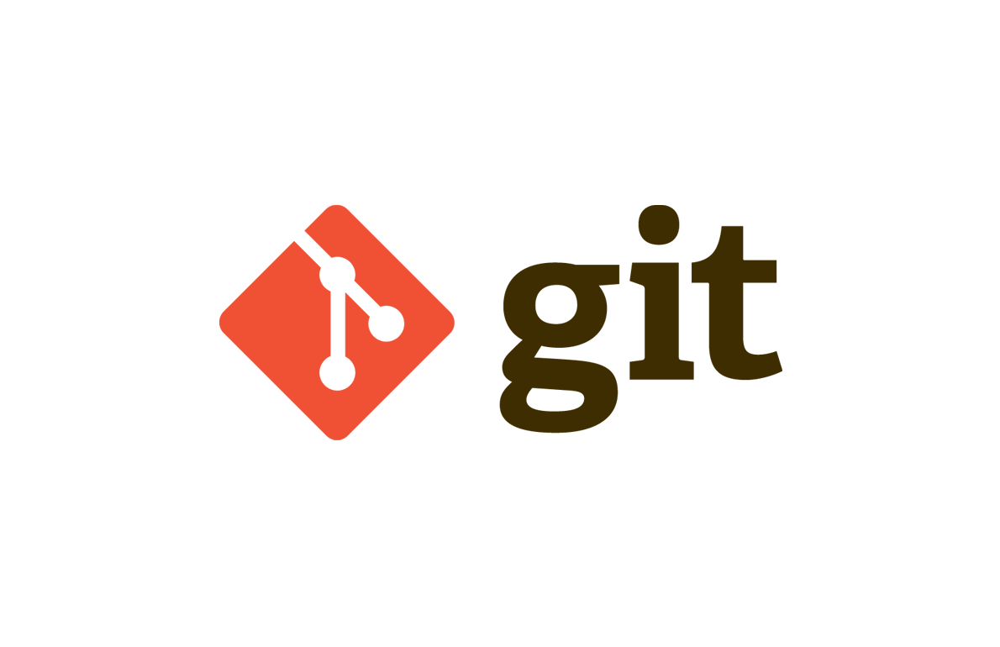

# mi-primer-repo
Primer repositorio de ejemplo

Este es nuestro primer repositorio en GitHub, una plataforma de desarrollo colaborativo que nos permite crear repositorios Git centralizados y compartidos.

